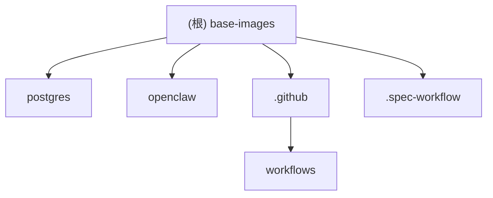

# base-images 项目文档

> 最后更新：2026-03-19

## 变更记录 (Changelog)

### 2026-03-19
- 初始化项目 AI 上下文
- 生成根级 CLAUDE.md
- 生成 postgres 模块 CLAUDE.md
- **新增 openclaw 模块**：构建自定义 OpenClaw 镜像
- 建立 .claude/index.json 索引

---

## 项目愿景

base-images 是一个基础 Docker 镜像仓库，用于构建和维护项目所需的自定义容器镜像。该仓库提供预配置的镜像，包括：

1. **PostgreSQL 镜像**：集成向量搜索扩展（pgvector、VectorChord、pgvecto.rs），专为机器学习和 AI 应用场景优化
2. **OpenClaw 镜像**：个人 AI 助手平台，预装 Python、FFmpeg 等工具，支持多基础镜像

---

## 架构总览

本项目采用 Docker 容器化架构，通过 GitHub Actions 实现自动化构建和多平台支持（amd64/arm64）。核心架构包括：

1. **镜像构建层**：
   - PostgreSQL：基于官方 pgvector/pgvector 镜像，叠加 VectorChord 和 pgvecto.rs 扩展
   - OpenClaw：基于 Node.js 官方镜像，预装 Python、FFmpeg 等工具
2. **配置管理层**：
   - PostgreSQL：提供 HDD/SSD 两种存储优化配置模板
   - OpenClaw：提供默认配置和环境变量支持
3. **CI/CD 层**：GitHub Actions 工作流自动构建和发布到 GitHub Container Registry

---

## 模块结构图



---

## 模块索引

| 模块路径 | 职责描述 | 语言/技术 | 入口文件 |
|---------|---------|----------|---------|
| [postgres](./postgres/CLAUDE.md) | PostgreSQL 基础镜像构建，集成向量搜索扩展 | Dockerfile, Shell | Dockerfile |
| [openclaw](./openclaw/CLAUDE.md) | OpenClaw 个人 AI 助手镜像，预装 Python、FFmpeg | Dockerfile, Shell | Dockerfile |

---

## 运行与开发

### 本地构建

#### PostgreSQL 镜像

```bash
# 进入 postgres 目录
cd postgres

# 构建镜像（示例）
docker build . \
  --build-arg="PG_MAJOR=17" \
  --build-arg="PGVECTOR_TAG=0.8.0" \
  --build-arg="VECTORCHORD_TAG=0.3.0" \
  --build-arg="PGVECTORS_TAG=0.3.0"
```

#### OpenClaw 镜像

```bash
# 进入 openclaw 目录
cd openclaw

# 构建默认镜像（Ubuntu 24.04）
docker build -t openclaw:local .

# 构建其他变体
docker build -f Dockerfile.ubuntu22 -t openclaw:ubuntu22 .
docker build -f Dockerfile.debian -t openclaw:debian .

# 指定版本构建
docker build --build-arg OPENCLAW_VERSION=2026.3.13 -t openclaw:2026.3.13 .
```

### 本地运行（使用 docker-compose）

```bash
# PostgreSQL
cd postgres
docker-compose up -d

# OpenClaw
cd openclaw
docker-compose up -d
```

### 版本矩阵

#### PostgreSQL
支持的版本组合定义在 `postgres/versions.yaml` 中：
- PostgreSQL：14, 15, 16, 17, 18
- VectorChord：0.5.3
- pgvector：0.8.1

#### OpenClaw
支持的版本组合定义在 `openclaw/versions.yaml` 中：
- OpenClaw：latest（自动跟踪最新版本）
- 基础镜像：Ubuntu 24.04/22.04、Debian Bookworm
- Node.js：24.x（Ubuntu 24.04/Debian）、22.x（Ubuntu 22.04）
- Python：3.x（系统版本）
- FFmpeg：系统版本

---

## 测试策略

当前项目以镜像构建为主，测试策略包括：
1. **构建验证**：GitHub Actions 自动构建验证
2. **健康检查**：内置 healthcheck.sh 脚本
3. **数据完整性**：checksum 失败检测

---

## 编码规范

1. **Shell 脚本**：使用 `#!/usr/bin/env bash` shebang，启用 `set -eo pipefail`
2. **Dockerfile**：多阶段构建，清理缓存减少镜像体积
3. **配置文件**：使用模板变量，支持运行时替换

---

## AI 使用指引

### 适合 AI 辅助的任务

#### PostgreSQL 模块
1. 添加新的 PostgreSQL 版本支持
2. 更新扩展版本（pgvector、VectorChord）
3. 优化配置参数
4. 编写构建脚本和自动化工具

#### OpenClaw 模块
1. 添加新的基础镜像变体
2. 更新 OpenClaw 版本
3. 添加新的预装工具
4. 优化镜像体积和构建速度
5. 自定义配置文件和启动脚本

### 需要注意的事项

#### 通用事项
1. 修改 Dockerfile 时注意多架构兼容性（amd64/arm64）
2. 版本更新需同步更新 `versions.yaml` 和 CI 工作流
3. Secrets 文件不应提交到版本控制

#### PostgreSQL 模块
1. 配置文件修改需考虑 HDD/SSD 两种场景
2. 扩展版本兼容性需验证

#### OpenClaw 模块
1. 多基础镜像变体需分别测试
2. 预装工具版本可能因基础镜像不同而异
3. 注意 OpenClaw 官方 API 变更
4. 暴露 Gateway 到外网时必须配置认证

### 推荐的 AI 工作流

#### PostgreSQL 模块
1. 添加新版本：修改 versions.yaml -> 验证构建参数 -> 测试镜像
2. 优化配置：分析性能需求 -> 调整 postgresql.conf 模板 -> 测试验证
3. 扩展功能：评估依赖 -> 更新 Dockerfile -> 验证安装脚本

#### OpenClaw 模块
1. 添加新基础镜像：创建新 Dockerfile -> 更新 versions.yaml -> 测试构建
2. 添加预装工具：更新 Dockerfile -> 测试工具可用性 -> 更新文档
3. 更新 OpenClaw 版本：检查上游发布 -> 更新 versions.yaml -> 验证构建
4. 自定义配置：修改配置模板 -> 测试启动脚本 -> 更新文档

---

## 相关资源

### PostgreSQL 模块
- [pgvector 官方仓库](https://github.com/pgvector/pgvector)
- [VectorChord 官方仓库](https://github.com/tensorchord/VectorChord)
- [pgvecto.rs 官方仓库](https://github.com/tensorchord/pgvecto.rs)
- [PostgreSQL 官方文档](https://www.postgresql.org/docs/)

### OpenClaw 模块
- [OpenClaw 官方网站](https://openclaw.ai)
- [OpenClaw 官方文档](https://docs.openclaw.ai)
- [OpenClaw GitHub 仓库](https://github.com/openclaw/openclaw)
- [Node.js 官方文档](https://nodejs.org/docs/)
- [FFmpeg 官方文档](https://ffmpeg.org/documentation.html)
