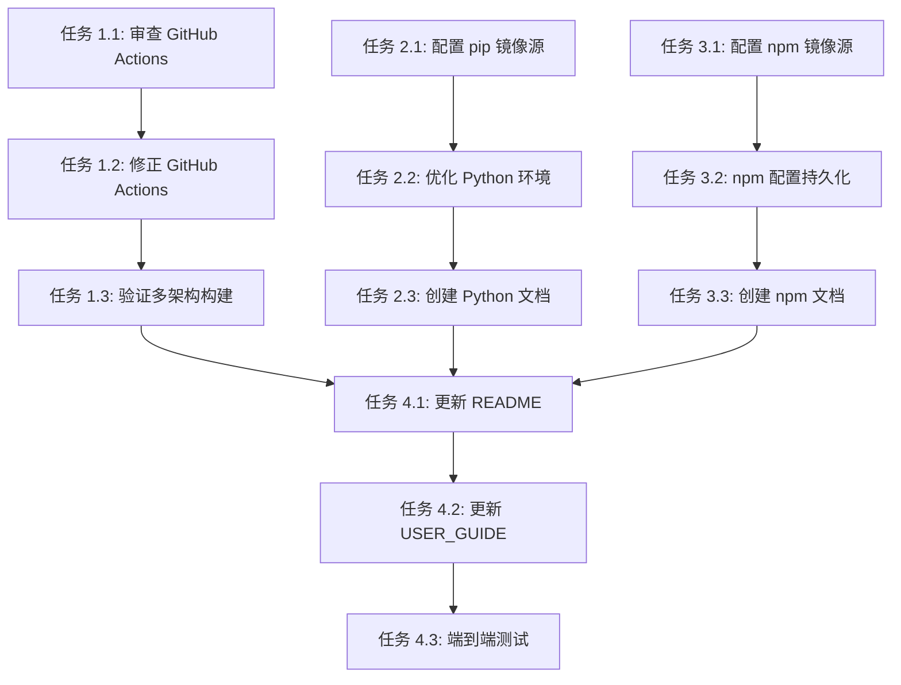

# OpenClaw Docker 镜像优化实施计划

## 已明确的决策

基于用户需求和项目现状，以下技术选型和架构决策已确定：

- **基础镜像架构**：继续使用 OpenClaw 官方镜像作为基础（ghcr.io/openclaw/openclaw:latest）
- **多架构支持**：保持 linux/amd64 和 linux/arm64 双架构支持
- **镜像构建工具**：使用 Docker Buildx 进行多架构构建
- **CI/CD 平台**：GitHub Actions 自动化构建和发布
- **Python 支持**：使用系统包管理器安装的 Python 3（python3、python3-pip、python3-venv）
- **包管理器镜像**：针对中国用户，配置国内镜像源（pip 清华源、npm 淘宝源）
- **安全策略**：保持非 root 用户运行（node 用户）

---

## 整体规划概述

### 项目目标

优化 OpenClaw Docker 镜像，为中国用户提供更好的使用体验，具体包括：

1. **修正 CI/CD 配置**：确保 GitHub Actions 工作流正确实现 README 中声明的功能
2. **添加 Python 虚拟环境支持**：集成 venv 功能，配置国内 pip 镜像源
3. **添加 npm 国内镜像支持**：配置 npm 淘宝镜像，加速 Node.js 包下载
4. **完善文档**：更新使用文档，说明新增功能的使用方法

### 技术栈

- **容器运行时**：Docker 24.0+
- **构建工具**：Docker Buildx
- **CI/CD**：GitHub Actions
- **基础镜像**：ghcr.io/openclaw/openclaw:latest
- **扩展工具**：Python 3、pip、venv、FFmpeg、Git
- **镜像源**：
  - pip：清华大学 TUNA 镜像源（https://pypi.tuna.tsinghua.edu.cn/simple）
  - npm：淘宝 NPM 镜像（https://registry.npmmirror.com）

### 主要阶段

1. **阶段 1：CI/CD 验证与修正**（预估 2-3 小时）
   - 审查当前 GitHub Actions 工作流
   - 验证多架构构建配置
   - 修正与 README 声明不符的问题

2. **阶段 2：Python 虚拟环境支持**（预估 3-4 小时）
   - 配置 pip 国内镜像源
   - 优化 Python 安装配置
   - 编写虚拟环境使用文档

3. **阶段 3：npm 国内镜像支持**（预估 2-3 小时）
   - 配置 npm 淘宝镜像源
   - 添加 npm 配置持久化
   - 编写使用说明

4. **阶段 4：文档更新与测试**（预估 2 小时）
   - 更新所有相关文档
   - 进行端到端测试
   - 验证镜像构建和运行

---

## 详细任务分解

### 阶段 1：CI/CD 验证与修正

#### 任务 1.1：审查 GitHub Actions 工作流配置

- **目标**：识别当前 CI/CD 配置与 README 声明的差异
- **输入**：
  - `.github/workflows/build-openclaw.yml`（当前工作流）
  - `openclaw/README.md`（功能声明）
  - `openclaw/versions.yaml`（版本矩阵）
- **输出**：问题清单和修正方案
- **涉及文件**：
  - `.github/workflows/build-openclaw.yml`
  - `openclaw/versions.yaml`
- **预估工作量**：1 小时
- **具体检查项**：
  - [ ] 是否支持多架构构建（linux/amd64、linux/arm64）
  - [ ] 是否支持多基础镜像变体（Ubuntu 24.04/22.04、Debian）
  - [ ] 版本矩阵是否与 versions.yaml 一致
  - [ ] 镜像标签生成规则是否正确
  - [ ] 缓存策略是否有效
  - [ ] 是否正确推送到 GHCR

#### 任务 1.2：修正 GitHub Actions 工作流

- **目标**：修正任务 1.1 中识别的问题
- **输入**：任务 1.1 的问题清单
- **输出**：修正后的 GitHub Actions 工作流配置
- **涉及文件**：
  - `.github/workflows/build-openclaw.yml`
- **预估工作量**：1-2 小时
- **修正内容**：
  - 添加多基础镜像构建矩阵
  - 修正镜像标签生成逻辑
  - 优化构建缓存配置
  - 确保支持手动触发和定时构建

#### 任务 1.3：验证多架构构建

- **目标**：验证修正后的工作流支持 amd64/arm64 双架构
- **输入**：修正后的 GitHub Actions 配置
- **输出**：构建验证报告
- **涉及文件**：无（CI/CD 平台验证）
- **预估工作量**：30 分钟（观察 CI 运行）
- **验证方法**：
  - 推送代码触发构建
  - 检查构建日志确认多架构支持
  - 验证镜像 manifest 包含两个架构

---

### 阶段 2：Python 虚拟环境支持

#### 任务 2.1：配置 pip 国内镜像源

- **目标**：为 Python pip 配置清华大学 TUNA 镜像源
- **输入**：当前 `openclaw/Dockerfile`
- **输出**：配置了 pip 镜像源的 Dockerfile
- **涉及文件**：
  - `openclaw/Dockerfile`
- **预估工作量**：1 小时
- **实现方式**：
  ```dockerfile
  # 配置 pip 镜像源（清华大学 TUNA）
  RUN pip3 config set global.index-url https://pypi.tuna.tsinghua.edu.cn/simple && \
      pip3 config set install.trusted-host pypi.tuna.tsinghua.edu.cn
  ```
- **注意事项**：
  - 保持 pip 配置持久化（在系统级配置）
  - 确保镜像源 URL 可访问
  - 验证 pip 安装速度提升

#### 任务 2.2：优化 Python 虚拟环境支持

- **目标**：确保 python3-venv 正确安装并可用
- **输入**：当前 Dockerfile
- **输出**：优化后的 Python 环境配置
- **涉及文件**：
  - `openclaw/Dockerfile`
- **预估工作量**：1 小时
- **实现内容**：
  - 验证 python3-venv 包已安装（当前已有）
  - 添加虚拟环境创建示例脚本
  - 配置虚拟环境默认使用国内 pip 源

#### 任务 2.3：创建 Python 使用文档

- **目标**：编写 Python 和虚拟环境使用指南
- **输入**：配置好的 Python 环境
- **输出**：Python 使用文档章节
- **涉及文件**：
  - `openclaw/README.md`（新增章节）
  - `openclaw/USER_GUIDE.md`（更新）
- **预估工作量**：1-2 小时
- **文档内容**：
  - Python 版本验证
  - pip 国内镜像源使用说明
  - 创建和激活虚拟环境示例
  - 常用 Python 包安装示例

---

### 阶段 3：npm 国内镜像支持

#### 任务 3.1：配置 npm 淘宝镜像源

- **目标**：为 npm 配置淘宝镜像源
- **输入**：当前 Dockerfile
- **输出**：配置了 npm 镜像源的 Dockerfile
- **涉及文件**：
  - `openclaw/Dockerfile`
- **预估工作量**：1 小时
- **实现方式**：
  ```dockerfile
  # 配置 npm 淘宝镜像源
  USER node
  RUN npm config set registry https://registry.npmmirror.com
  USER root
  ```
- **注意事项**：
  - 切换到 node 用户后再配置 npm（因为 npm 配置保存在用户目录）
  - 确保配置在镜像构建时生效
  - 验证 npm 安装速度提升

#### 任务 3.2：添加 npm 配置持久化

- **目标**：确保 npm 配置在容器重启后保持
- **输入**：配置好的 npm 环境
- **输出**：npm 配置持久化方案
- **涉及文件**：
  - `openclaw/Dockerfile`
  - `openclaw/docker-compose.user.yml`（可选，添加 volume 挂载）
- **预估工作量**：1 小时
- **实现内容**：
  - 在 node 用户目录创建 .npmrc 配置文件
  - 确保 npm 全局包安装目录可写
  - 提供配置持久化 volume 挂载建议

#### 任务 3.3：创建 npm 使用文档

- **目标**：编写 npm 和 Node.js 包管理使用指南
- **输入**：配置好的 npm 环境
- **输出**：npm 使用文档章节
- **涉及文件**：
  - `openclaw/README.md`（新增章节）
  - `openclaw/USER_GUIDE.md`（更新）
- **预估工作量**：1 小时
- **文档内容**：
  - Node.js 和 npm 版本验证
  - npm 淘宝镜像源使用说明
  - 常用 npm 命令示例
  - 全局包安装和持久化说明

---

### 阶段 4：文档更新与测试

#### 任务 4.1：更新 README.md

- **目标**：在 README 中添加新功能说明
- **输入**：实施完成的功能
- **输出**：更新后的 README.md
- **涉及文件**：
  - `openclaw/README.md`
- **预估工作量**：1 小时
- **更新内容**：
  - 在"主要特性"部分添加国内镜像源支持说明
  - 新增"Python 和 pip 使用"章节
  - 新增"Node.js 和 npm 使用"章节
  - 更新"预装工具"列表

#### 任务 4.2：更新 USER_GUIDE.md

- **目标**：在用户指南中添加详细使用说明
- **输入**：新功能实现
- **输出**：更新后的 USER_GUIDE.md
- **涉及文件**：
  - `openclaw/USER_GUIDE.md`
- **预估工作量**：1 小时
- **更新内容**：
  - Python 虚拟环境使用详细步骤
  - pip 国内镜像源使用示例
  - npm 淘宝镜像源使用示例
  - 常见问题解答（FAQ）更新

#### 任务 4.3：端到端测试

- **目标**：验证所有功能正常工作
- **输入**：更新后的代码和文档
- **输出**：测试报告
- **涉及文件**：无（测试验证）
- **预估工作量**：1 小时
- **测试内容**：
  - 本地构建镜像测试
  - Python 和 pip 功能验证
  - npm 功能验证
  - 容器启动和运行验证
  - 多架构构建验证（CI 环境）

---

## 需要进一步明确的问题

### 问题 1：GitHub Actions 工作流是否需要支持多基础镜像变体构建？

**背景**：README 中声明支持 Ubuntu 24.04/22.04 和 Debian 三种基础镜像，但当前 GitHub Actions 工作流只构建单一变体。

**推荐方案**：

- **方案 A：添加构建矩阵，自动构建所有变体**
  - **优点**：
    - 用户可以直接拉取所需变体，无需本地构建
    - 完全符合 README 声明
    - 提供更多选择
  - **缺点**：
    - 增加 CI 构建时间（3 个变体 × 2 架构 = 6 个构建任务）
    - 增加 GitHub Actions 使用额度
    - 需要维护多个镜像标签

- **方案 B：仅构建默认变体（Ubuntu 24.04），其他变体提供本地构建说明**
  - **优点**：
    - CI 构建时间短
    - 节省资源
    - 维护简单
  - **缺点**：
    - 用户需要本地构建其他变体
    - 与 README 声明不完全一致

- **方案 C：构建默认变体 + Ubuntu 22.04 LTS（两个最常用）**
  - **优点**：
    - 平衡功能和资源
    - 覆盖大部分使用场景
  - **缺点**：
    - Debian 用户仍需本地构建
    - 需要维护两个变体的 CI 配置

**等待用户选择**：

```
请选择您偏好的方案，或提供其他建议：

[ ] 方案 A：构建所有变体（Ubuntu 24.04、Ubuntu 22.04、Debian）
[ ] 方案 B：仅构建默认变体（Ubuntu 24.04）
[ ] 方案 C：构建常用变体（Ubuntu 24.04 + Ubuntu 22.04）
[ ] 其他方案：________________
```

---

### 问题 2：pip 和 npm 镜像源配置是否需要可配置化？

**背景**：当前方案将镜像源硬编码在 Dockerfile 中，用户无法自定义。

**推荐方案**：

- **方案 A：硬编码国内镜像源（固定配置）**
  - **优点**：
    - 实现简单
    - 开箱即用，无需额外配置
    - 适合目标用户（中国用户）
  - **缺点**：
    - 不灵活，无法切换镜像源
    - 不适合非中国用户

- **方案 B：通过环境变量可配置**
  - **优点**：
    - 灵活性高
    - 用户可以自定义镜像源
    - 支持不同地区用户
  - **缺点**：
    - 需要用户手动配置
    - 实现复杂度增加
    - 需要编写配置说明

- **方案 C：默认国内镜像源，提供切换说明**
  - **优点**：
    - 平衡易用性和灵活性
    - 默认优化中国用户体验
    - 提供切换方法文档
  - **缺点**：
    - 需要维护切换文档
    - 用户切换需要手动操作

**等待用户选择**：

```
请选择您偏好的方案，或提供其他建议：

[ ] 方案 A：固定使用国内镜像源
[ ] 方案 B：环境变量可配置
[ ] 方案 C：默认国内镜像源，提供切换说明
[ ] 其他方案：________________
```

---

### 问题 3：是否需要为 Python 虚拟环境创建示例项目？

**背景**：为了让用户快速上手 Python 虚拟环境，可以提供示例项目和脚本。

**推荐方案**：

- **方案 A：仅提供文档说明**
  - **优点**：
    - 实现简单
    - 用户可以按需创建
  - **缺点**：
    - 需要用户自己操作
    - 新手可能不知道如何开始

- **方案 B：提供示例脚本和项目模板**
  - **优点**：
    - 快速上手
    - 最佳实践示例
    - 降低学习曲线
  - **缺点**：
    - 需要维护示例代码
    - 增加项目复杂度
    - 示例可能不适用所有场景

- **方案 C：提供文档说明 + 常用场景示例**
  - **优点**：
    - 平衡详细和实用
    - 覆盖常见使用场景
  - **缺点**：
    - 需要编写示例文档
    - 维护成本适中

**等待用户选择**：

```
请选择您偏好的方案，或提供其他建议：

[ ] 方案 A：仅提供文档说明
[ ] 方案 B：提供完整示例项目和脚本
[ ] 方案 C：提供文档说明 + 常用场景示例
[ ] 其他方案：________________
```

---

### 问题 4：npm 全局包安装是否需要特殊处理？

**背景**：容器默认以 node 用户运行，npm 全局包安装可能需要特殊配置。

**推荐方案**：

- **方案 A：不推荐全局安装，推荐本地安装**
  - **优点**：
    - 避免 npm 全局包管理问题
    - 项目依赖更清晰
    - 符合 Node.js 最佳实践
  - **缺点**：
    - 限制用户使用习惯

- **方案 B：配置 npm 全局目录到用户可写路径**
  - **优点**：
    - 支持全局安装
    - 用户习惯不变
    - 配置简单
  - **缺点**：
    - 全局包不持久化（除非挂载 volume）

- **方案 C：提供全局安装说明和持久化建议**
  - **优点**：
    - 灵活性高
    - 用户可选择方案
    - 提供最佳实践
  - **缺点**：
    - 需要详细文档说明
    - 用户需要理解权限问题

**等待用户选择**：

```
请选择您偏好的方案，或提供其他建议：

[ ] 方案 A：不推荐全局安装
[ ] 方案 B：配置全局目录到用户可写路径
[ ] 方案 C：提供全局安装说明和持久化建议
[ ] 其他方案：________________
```

---

## 用户反馈区域

请在此区域补充您对整体规划的意见和建议：

```
用户补充内容：
---
---
---
```

---

## 风险评估

### 高风险

1. **多架构构建失败**（影响：严重）
   - **风险描述**：修改后的 CI/CD 配置可能导致 arm64 架构构建失败
   - **应对措施**：
     - 在本地使用 Docker Buildx 测试多架构构建
     - 监控 GitHub Actions 构建日志
     - 准备回滚方案（保留原配置）

2. **镜像源访问不稳定**（影响：中等）
   - **风险描述**：国内镜像源可能出现临时不可访问的情况
   - **应对措施**：
     - 提供镜像源切换说明
     - 文档中列出备用镜像源
     - 监控镜像源可用性

### 中风险

1. **用户目录权限问题**（影响：中等）
   - **风险描述**：npm 配置保存在 node 用户目录，可能因权限问题失败
   - **应对措施**：
     - 确保 Dockerfile 中正确切换用户
     - 在文档中说明权限相关注意事项
     - 提供 docker exec 命令示例

2. **镜像体积增加**（影响：低）
   - **风险描述**：添加配置文件可能导致镜像体积轻微增加
   - **应对措施**：
     - 配置文件很小（KB 级别），影响可忽略
     - 持续优化 Dockerfile，减少不必要的层

### 低风险

1. **文档维护负担**（影响：低）
   - **风险描述**：新增功能需要更新多个文档，维护成本增加
   - **应对措施**：
     - 建立文档更新检查清单
     - 使用模板统一文档格式
     - 定期审查文档一致性

---

## 预期复杂度

- **总体复杂度**：中等
- **技术难度**：低到中等（主要是配置修改和文档编写）
- **时间投入**：预计 10-13 小时
- **主要挑战**：
  - GitHub Actions 工作流调试（需要多次推送测试）
  - 多架构构建验证（需要 CI 环境支持）
  - 文档编写和同步更新

---

## 验收标准

### 功能验收

- [ ] GitHub Actions 成功构建多架构镜像（amd64/arm64）
- [ ] pip 国内镜像源配置生效，安装速度显著提升
- [ ] Python 虚拟环境功能正常，可以创建和使用
- [ ] npm 淘宝镜像源配置生效，安装速度显著提升
- [ ] 所有文档更新完整，说明清晰

### 测试验收

- [ ] 本地构建测试通过（Ubuntu 24.04、Ubuntu 22.04、Debian）
- [ ] CI/CD 构建测试通过（所有变体）
- [ ] Python 功能测试：pip install、venv 创建、包安装
- [ ] Node.js 功能测试：npm install、全局包安装
- [ ] 容器启动测试：健康检查通过

### 文档验收

- [ ] README.md 包含所有新功能说明
- [ ] USER_GUIDE.md 包含详细使用步骤
- [ ] DEPLOYMENT.md 包含构建和部署说明
- [ ] FAQ 部分涵盖常见问题
- [ ] 所有示例命令可执行且正确

---

## 依赖关系

### 前置依赖

- Docker 24.0+ 环境
- GitHub Actions 权限（用于推送和触发构建）
- 访问 ghcr.io 的权限

### 后置依赖

- 用户需要 Docker 环境使用镜像
- 用户需要网络访问拉取镜像

### 任务依赖关系



---

## 后续维护建议

1. **定期检查镜像源可用性**
   - 每月检查 pip 和 npm 镜像源状态
   - 更新备用镜像源列表

2. **监控 GitHub Actions 构建状态**
   - 设置构建失败告警
   - 定期检查构建时间和资源使用

3. **用户反馈收集**
   - 收集用户对镜像源的使用反馈
   - 根据反馈调整配置

4. **文档持续更新**
   - 根据用户问题更新 FAQ
   - 补充实际使用案例

---

## 附录

### A. pip 国内镜像源列表

| 镜像源 | URL | 说明 |
|--------|-----|------|
| 清华大学 TUNA | https://pypi.tuna.tsinghua.edu.cn/simple | 推荐使用，稳定快速 |
| 阿里云 | https://mirrors.aliyun.com/pypi/simple/ | 备用选择 |
| 中国科技大学 | https://pypi.mirrors.ustc.edu.cn/simple/ | 备用选择 |
| 豆瓣 | https://pypi.douban.com/simple/ | 备用选择 |

### B. npm 国内镜像源列表

| 镜像源 | URL | 说明 |
|--------|-----|------|
| 淘宝 NPM 镜像 | https://registry.npmmirror.com | 推荐使用，官方维护 |
| 华为云镜像 | https://mirrors.huaweicloud.com/repository/npm/ | 备用选择 |
| 腾讯云镜像 | https://mirrors.cloud.tencent.com/npm/ | 备用选择 |

### C. 参考资源

- [Docker Buildx 多架构构建文档](https://docs.docker.com/build/building/multi-platform/)
- [GitHub Actions 工作流语法](https://docs.github.com/en/actions/reference/workflow-syntax-for-github-actions)
- [pip 用户指南](https://pip.pypa.io/en/stable/user_guide/)
- [npm 配置文档](https://docs.npmjs.com/cli/v10/configuring-npm)
- [OpenClaw 官方文档](https://docs.openclaw.ai)

---

**文档版本**：v1.0
**创建日期**：2026-03-30
**最后更新**：2026-03-30
**维护者**：项目维护团队
